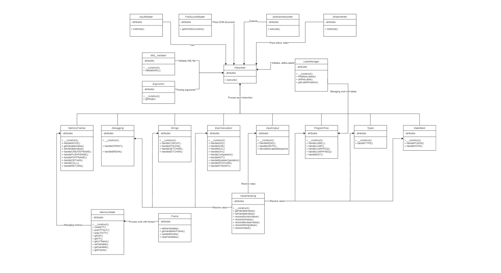

# Implementation Documentation for Task 2 in IPP 2023/2024

**Name:** Slabik Yaroslav

## Introduction

This documentation describes the implementation of 2 IPP subject project. The project task is an interpreter that should read XML instructions of the unstructured imperative language IPPCode24 and execute them sequentially.

## Structure

The interpreter consists of several main and auxiliary classes that cover different aspects of the interpretation process. Below is a class diagram that shows all the main relationships between the different classes of the project.

## Description of the class

**Interpreter** - Is the core component of the IPPcode24 interpreter. This class orchestrates the initialization of various helper classes that handle specific subsets of instructions and integrates their functionality to process the entire program from input to output.

**ArgControl** — A class designed to manage arguments in passed instructions. It provides validation and processing of arguments by extracting them from XML structures and converting them to appropriate data types.

**XML_Validator** - Validation of the structure of the introductory XML instructions. Uses an array of sorted instructions to check for various errors in the XML document structure.

**LabelManager** - Main label work. Used at the beginning of a program so that at the time instructions are processed, the `$labels` array contains all the labels that occur in the XML document.

**MemoryModel** - Fundamental component for managing the memory environment of an IPPcode24 interpreter. Extends the Frame class to include more flexible memory handling.

**Frame** - Main work with memory frames. Provides functionality for defining, retrieving and checking the existence of variables, as well as clearing them.

**ValueHandling** - Main work with values of literals and variables. The class functions are divided into either value processing of a specific data type or general value processing, in the process of which the data type is also specified.

**MemoryFrames** - Processing instructions for working with program memory and call stack. The main work of the class is done with the help of the MemoryModel class. Also in the class there is an array `$callStack`, which contains indexes of all instructions necessary for `CALL/RETURN` instructions operation.

**DataStack** - Processing instructions that interact with the data stack. The operation of these instructions is done through the `array_push, array_pop` functions and the `$dataStack` array, into which a value is either placed or fetched from the top, depending on the instruction being processed.

**ExprCalculation** - Processing basic math, logic, comparison and conversion instructions. Closely related to ValueHandling for resolving variable values.

**InputOutput** - Processing of read and write instructions. Performs its work using the `InputReader` and `OutputWriter` interfaces that are passed through the `Interpreter` class.

**Strings** - String Instruction Processing. Part of the work is done thanks to the functions of the internal php library: `mb_strlen` - to calculate the length of the string, `mb_substr` - to return the character at a given position.

**Types** - TYPE instruction processing. To handle the situation where `TYPE` must write a `nil` value to a variable to avoid the error of `WRITE` writing an empty string, `TYPE` writes a special `nil@nil` value to the variable, which will signal that the value was written through `TYPE` and should be output correctly.

**ProgramFlow** - Processing program flow instructions. Works in conjunction with the `$labelManager` class, which at the time of function execution already has the necessary instruction indexes. If the conditions of some functions are fulfilled, the index of the instruction is changed to the index stored in the array, otherwise the index is incremented to process further instructions.

**Debugging** - Debugging instruction processing. Outputs either the value that the user wrote or the state of the interpreter( The index of the current instruction, the count of instructions executed, the count of global, temporary frames, and the local frame stack size).

## Structure of the execution process

1. **Initialization:** reading instructions, preparing and configuring all classes.

2. **Parsing and sorting instructions:** Instructions are sorted based on the order attribute. code block screenshot

3. **Validate XML document:** `$xmlValidator->validateXML` is used to validate the XML structure. If an error is found, the work will end with the corresponding error code and a message containing the details of the error will be printed to stderr.

4. **Label Initialization:** `$labelManager->initializeLabels` initializes all labels that occur in XML and stores them in an array for further use by appropriate instructions.

5. **Execution:** Sequential processing of all sorted instructions